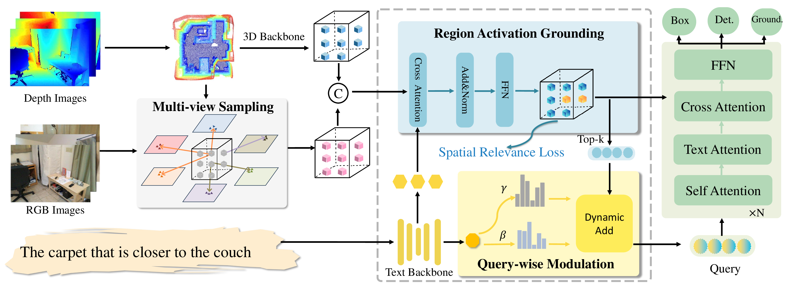

<br>
<p align="center">
<h1 align="center"><strong>Grounding Beyond Detection: Enhancing Contextual Understanding in Embodied 3D Grounding</strong></h1>

## 🐣 Abstract

<!--  -->

<div style="text-align: center;">
    
</div>
Embodied 3D grounding aims to localize target objects described in human instructions from ego-centric viewpoint. Most methods typically follow a two-stage paradigm where a trained 3D detector's optimized backbone parameters are used to initialize a grounding model. In this study, we explore a fundamental question: Does embodied 3D grounding benefit enough from detection? To answer this question, we assess the grounding performance of detection models using predicted boxes filtered by the target category. Surprisingly, these detection models without any instruction-specific training outperform the grounding models explicitly trained with language instructions. This indicates that even category-level embodied 3D grounding may not be well resolved, let alone more fine-grained context-aware grounding. Motivated by this finding, we propose DEGround, which shares DETR queries as object representation for both DEtection and Grounding and enables the grounding to benefit from basic category classification and box detection. Based on this framework, we further introduce a regional activation grounding module that highlights instruction-related regions and a query-wise modulation module that incorporates sentence-level semantic into the query representation, strengthening the context-aware understanding of language instructions. Remarkably, DEGround outperforms state-of-the-art model BIP3D by 7.52% at overall accuracy on the EmbodiedScan validation set.

## 🌟 News

- \[2024-6\] We release the [paper](https://arxiv.org/abs/2506.05199) to arxiv. DEGround achieves SOTA performance on standard EmbodiedScan dataset.


## 🥇 Results on EmbodiedScan Benchmark

### 1. Results on Multi-view 3D Detection Validation Dataset

|Model |Overall | Head | Common | Tail | Small | Medium | Large | ScanNet | 3RScan | MP3D | ckpt | log |
|  :----  | :---: |  :---: | :---: |:---: | :---: | :---: | :---:| :---:|:---:|:---: |:---:|:---: |
|Ours |24.68|34.45|19.71|19.60|9.23|24.94|15.61|23.62|39.53|10.78 | - |-  


### 2. Results on Multi-view 3D Grounding Validation Dataset
|Dataset | Overall | Easy | Hard | View-dep | View-indep | ScanNet | 3RScan | MP3D | ckpt | log |
|  :----  | :---: | :---: | :---: | :---: | :---:| :---:|:---:|:---: | :---: | :----: 
|  Mini | 61.28 | 62.76 | 55.70 | 63.56| 61.40| 63.02|65.98|52.95 | - | -
|  Full  | 62.18 | 62.76 | 55.70 | 63.56 | 61.40| 63.02|65.98|52.95 | - | - 

### 3. [Results on Multi-view 3D Grounding Test Dataset](https://huggingface.co/spaces/AGC2024/visual-grounding-2024)

| Method            | Backbone   | Overall<sub>0.25</sub> | Easy<sub>0.25</sub> | Hard<sub>0.25</sub> | Overall<sub>0.5</sub> | Easy<sub>0.5</sub> | Hard<sub>0.5</sub> |
|-------------------|------------|--------------|-----------|-----------|-------------|----------|----------|
| [EmbodiedScan](https://github.com/OpenRobotLab/EmbodiedScan)  | ResNet-50  | 39.67        | 40.52     | 30.24     | 16.35       | 16.71    | 12.37    |
| [SAG3D](https://opendrivelab.github.io/Challenge%202024/multiview_Mi-Robot.pdf)       | ResNet-50  | 46.92        | 47.72     | 38.03     | 20.38       | 20.91    | 14.49    |
| [DenseGrounding](https://opendrivelab.github.io/Challenge%202024/multiview_THU-LenovoAI.pdf) | ResNet-50  | 59.59        | 60.39     | 50.81     | 34.72       | 35.46    | 26.56    |
| [BIP3D](https://github.com/HorizonRobotics/BIP3D?tab=readme-ov-file)        | Swin-T     | 70.53        | 71.22     | **62.91** | 39.69       | 40.40    | 31.77    |
| **DEGround (Ours)**| ResNet-50 | **70.56**    | **71.42** | 60.99     | **42.04**   | **42.65**| **35.18**|


## 📝 Citation

If you find our work helpful in your research, please consider citing:

```bibtex

@misc{zhang2025groundingdetectionenhancingcontextual,
      title={Grounding Beyond Detection: Enhancing Contextual Understanding in Embodied 3D Grounding}, 
      author={Yani Zhang and Dongming Wu and Hao Shi and Yingfei Liu and Tiancai Wang and Haoqiang Fan and Xingping Dong},
      year={2025},
      eprint={2506.05199},
      archivePrefix={arXiv},
      primaryClass={cs.CV},
      url={https://arxiv.org/abs/2506.05199}, 
}

```

## 💖 Acknowledgements

We deeply appreciate the authors' efforts in releasing the following projects to the community.
- [EmbodiedScan](https://github.com/OpenRobotLab/EmbodiedScan)
- [DETR](https://github.com/facebookresearch/detr)

